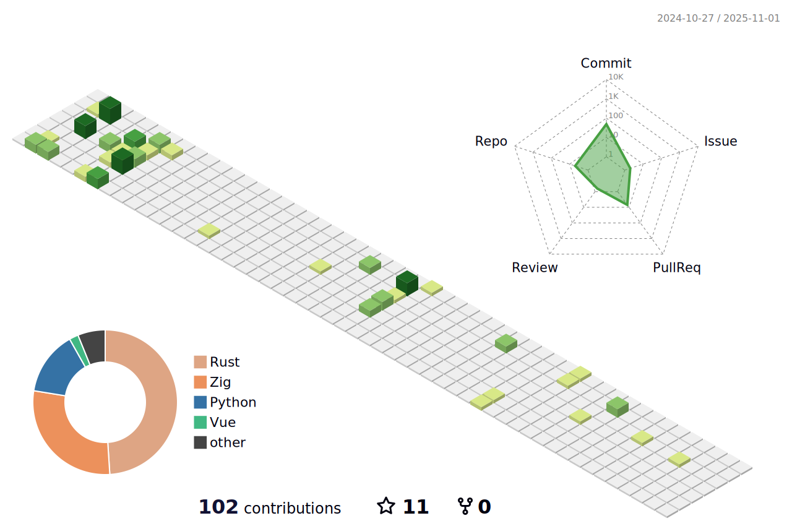

<h2 align="left">Languages and Tools:</h3>

     
    
    
    
    
    
    
     
     
     
     
    
    
    
    
    

  

<h2>Statistic</h2>

<h2>42 Statistic</h2>  

  <a href="https://github.com/Balgor18/Balgor18">
    <picture>
      <source media="(prefers-color-scheme: dark)" srcset="./profile-3d-contrib/profile-night-green.svg">
      
    </picture>
  </a>

  

<!-- | Language use | Project name     | Status                |
| :------ | :------- | :------------------------- |
|  | Libft |     |
|  | Get_next_line |    |
|  | Ft_printf |  |
|  | Netwhat |  |
| Virutal Box | Born2BeRoot |  |
|  | Ft_server |  |
|  | Minitalk |  |
|  | Push_swap |  |
|  | So_long |  |
|  | Philosophers |  |
|  | Minishell |  |
|  | Cub3D |  |
|  | Cpp_00 |  |
|  | Cpp_01 |  |
|  | Cpp_02 |  |
|  | Cpp_03 |  |
|  | Cpp_04 |  |
|  | Cpp_05 |  |
|  | Cpp_06 |  |
|  | Cpp_07 |  |
|  | Cpp_08 |  |
|  | Inception |  |
|  | Ft_irc |  |
|  | Ft_containers |  |
|   | Ft_transcendence |  |

| Language use | Exam Project     | Status                |
| :-------- | :------- | :------------------------- |
|  | Exam 02 |     |
|  | Exam 03 |     |
|  | Exam 04 |     |
|  | Exam 05 |     |
|  | Exam 06 |     | -->
